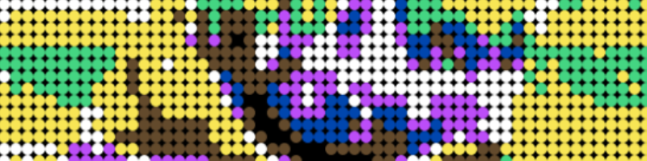
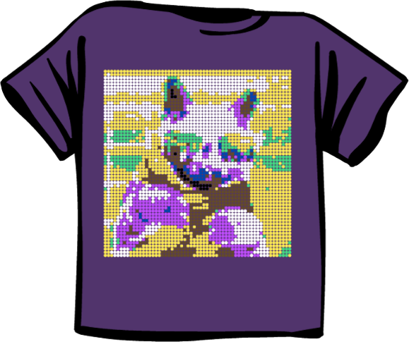
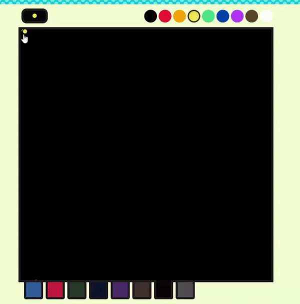

# jackbox-pointillism
 


> Picture to pointillism art

Simple python script to automate drawing a picture as art in JackBox 3: T-Shirt K-O by pointillism. I only had an hour and a half to write this script before the Twitch stream, so it is very rough.

## Getting Started
Installing
```console
pip install pillow pynput pywin32
```

## Understanding how to use it
Instead of injecting into the browser and controlling the canvas directly, this script uses the mouse and clicks on the points based on a reference point. 

1. Change the selected image path in **main.py** to an image file. It can take most images because pillow is great about image support.
2. Start the script and move the cursor to the top left of the drawing canvas.
3. Wait for the script to finish drawing the art.
   1. You have to start the script the moment the canvas comes up because it takes 50 seconds to draw, and you have an about 60 second time limit.
   2. Capslock will cancel the drawing, but I had issues with Windows not stopping because the click queue is too long.
   3. If you bump the mouse it will draw a line instead which will ruin the art.

## Understanding the limitations
There are two large limitations with the script that are very important to understand when using.

1. The color pallet is very small.
   1. There are only nine colors which leads to a lot of blending.
   2. The math I am using to determine the closest color is a little flawed. You will tend to get a lot of browns because it has lower weight on average. The fastest way I could find to help prevent a brown wash on the image is bumping up the colors and contrast heavily in photoshop. It would be possible to fix it, but I probably won't use the script again.
2. The resolution on the image is very small (59x59).
   1. The script will automatically resize the image to fit in the resolution configured which ~~may~~ will produce a low quality output.
   2. I put a tiny bit of space inbetween each dot to help with speed and clarity. You can adjust it, but it quickly starts smugging the output when moved closer together.
3. The game will start to glitch out if you draw too many points for it to render.
   1. The number of points is 3,481 (59x59) which will cause the game to glitch out if you have two pointillism shirts fighting at once.


## Samples

> An example shirt



> Example drawing in progress.



## Contribute
I welcome people to help improve this script, but I do not plain to maintain this because it was a one off script.